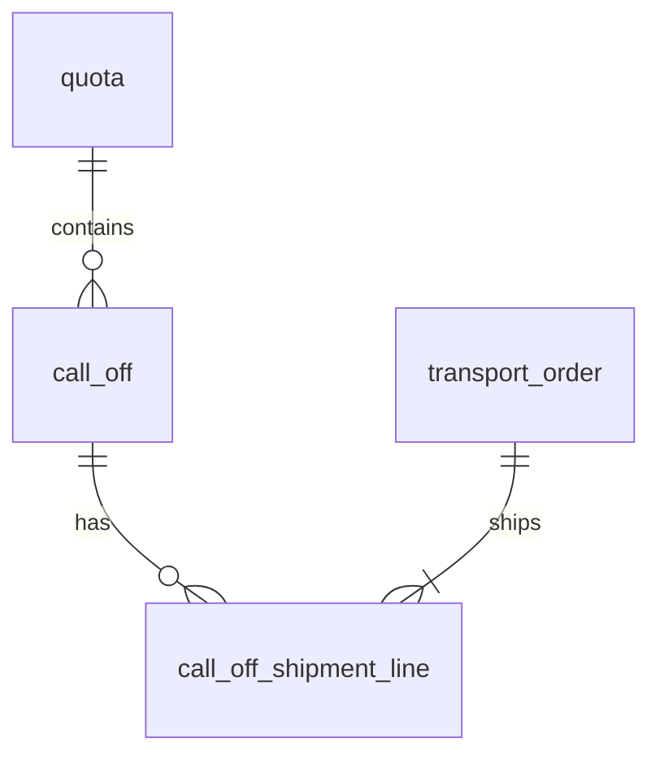
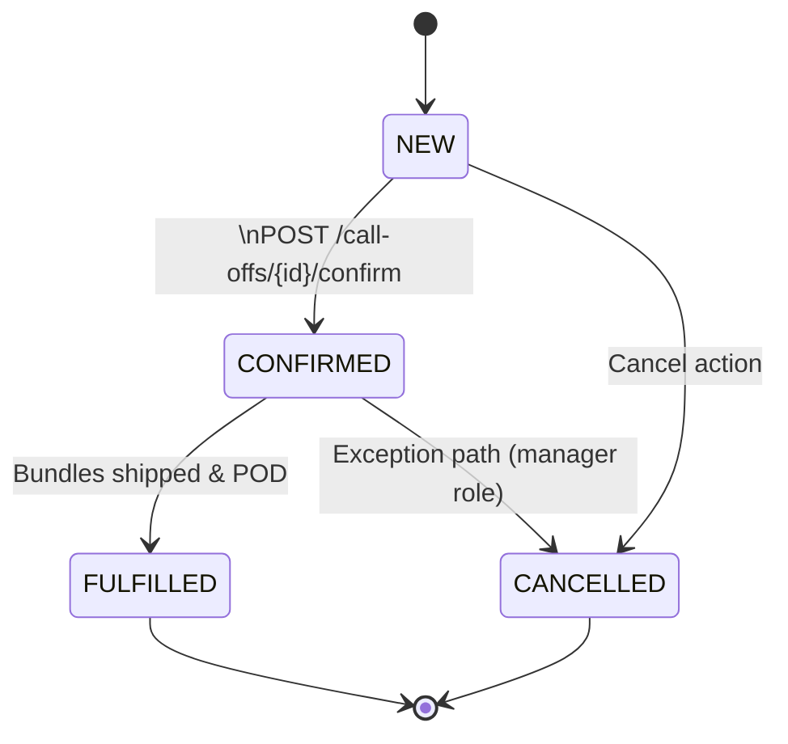

# Build Drop 1 — Call‑Off Domain

*Prepared July 12 2025*

> **Goal**  Deliver the first vertical slice of CSLA: Quota import from Titan, Call‑Off management, shipment lines, and linkage to Transport Orders. Everything lives in Supabase `, `, `, and ` schemas with React screens & Edge Functions.

---

## 1  Scope of this Drop

| In                                        | Out                           |
| ----------------------------------------- | ----------------------------- |
| Titan → Quota CDC consumer                | Inventory / bundle allocation |
| CRUD + workflow for Call‑Off              | Rate‑shopping, carrier API    |
| Shipment Lines under Call‑Off             | WMS handshake                 |
| Link Shipment → Transport Order (FK only) | Milestone tracking            |
| RLS policies & auth                       | Power BI reporting            |

---

## 2  Domain Data Model



### 2.1  `quota`  (import‑only)

| Field             | Type               | Notes                  |
| ----------------- | ------------------ | ---------------------- |
| `quota_id`        | UUID PK            | Matches Titan ID       |
| `counterparty_id` | UUID               | Titan counterparty dim |
| `direction`       | ENUM('BUY','SELL') | Direction of trade     |
| `period_month`    | DATE (YYYY‑MM‑01)  | Month bucket           |
| `qty_t`           | NUMERIC(12,3)      | Contract qty (tonnes)  |
| `tolerance_pct`   | NUMERIC(4,2)       | ± tolerance %          |
| `incoterm_code`   | CHAR(3)            | e.g. FOB, CIF          |
| `metal_code`      | VARCHAR(12)        | e.g. CU, AL, NI        |
| `created_at`      | TIMESTAMPTZ        | PG default             |

*Row‑Level‑Security* — No direct INSERT/UPDATE from UI; **Edge Fn** upserts from Titan CDC topic `titan.quota`.

---

### 2.2  `call_off`

| Field                     | Type                                            | Rule                               |
| ------------------------- | ----------------------------------------------- | ---------------------------------- |
| `call_off_id`             | UUID PK                                         | `gen_random_uuid()`                |
| `quota_id`                | UUID FK → quota                                 | Mandatory                          |
| `call_off_number`         | TEXT UNIQUE                                     | Human‑readable (e.g. CO‑2025‑0001) |
| `status`                  | ENUM('NEW','CONFIRMED','FULFILLED','CANCELLED') | Workflow below                     |
| `bundle_qty`              | INT                                             | Whole tonnes (1 bundle = 1 t)      |
| `requested_delivery_date` | DATE                                            | From customer                      |
| `counterparty_id`         | UUID                                            | Derived = quota.counterparty\_id   |
| `direction`               | ENUM                                            | Derived = quota.direction          |
| `incoterm_code`           | CHAR(3)                                         | Derived = quota.incoterm\_code     |
| `created_by`              | UUID                                            | Supabase auth.uid()                |
| `created_at`              | TIMESTAMPTZ                                     | default                            |

RLS: users may insert/update rows where `project_role IN ('OPS','TRADE')` **AND** belong to same BU as quota.

---

### 2.3  `call_off_shipment_line`

| Field                  | Type                            | Description            |
| ---------------------- | ------------------------------- | ---------------------- |
| `shipment_line_id`     | UUID PK                         |                        |
| `call_off_id`          | UUID FK → call\_off             |                        |
| `bundle_qty`           | INT                             | Qty to ship (1 t each) |
| `metal_code`           | VARCHAR(12)                     | Defaults from quota    |
| `destination_party_id` | UUID                            | Customer / DC          |
| `expected_ship_date`   | DATE                            |                        |
| `transport_order_id`   | UUID FK → transport\_order NULL | Filled on planning     |

---

### 2.4  `transport_order`  (stub)

Only FK reference for now; full spec lives in later drop.

---

## 3  Workflow State Machine – `call_off.status`



*Transition guards* — cannot CONFIRM if `bundle_qty` = 0 or quota exceed; cannot FULFIL unless all shipment lines linked to a delivered Transport Order.

---

## 4  API Contract (Edge Functions, OpenAPI 3.1 excerpt)

```yaml
POST /call-offs
  summary: Create a Call Off under a Quota
  requestBody:
    application/json:
      quota_id: uuid
      bundle_qty: integer
      requested_delivery_date: date
  responses:
    201:
      call_off_id: uuid

PATCH /call-offs/{id}
  summary: Update mutable fields (qty/date) when status = NEW

POST /call-offs/{id}/confirm
  summary: Transition NEW → CONFIRMED

GET /quotas/{id}/remaining-balance
  summary: Derived = qty_t ± tol − Σ confirmed bundle_qty
```

All endpoints enforce Supabase auth JWT; service‑to‑service calls (Titan import) use service key.

---

## 5  Build Tasks (@ vibe‑coding board)

| # | Task                                                  | Owner  | Est (d) |
| - | ----------------------------------------------------- | ------ | ------- |
| 1 | DB migration – quota, call\_off, shipment\_line       | DBA    | 0.5     |
| 2 | Edge Fn `import_quota_from_titan.ts` (Kafka consumer) | BE Dev | 1       |
| 3 | Edge Fn `calloff_crud.ts` with RLS checks             | BE Dev | 1       |
| 4 | React form “Create Call‑Off” + validation             | FE Dev | 1       |
| 5 | React view “Call‑Off list & status chips”             | FE Dev | 0.5     |
| 6 | Cypress E2E – create → confirm → cancel path          | QA     | 1       |
| 7 | Postman / Spectral API contract lint                  | DevOps | 0.5     |
| 8 | Demo & sign‑off with ops users                        | PM     | 0.5     |

*Total ≈ 6 dev days.*

---

## 6  Acceptance Criteria

*

---

### Notes / Open Questions

1. **Quota tolerance application** — apply at confirm time or fulfil time? (Current implementation: confirm.)
2. **Metal grade** — granularity at quota or shipment line?
3. **Counter‑party hierarchy** — single table or BU‑scoped?
4. **Transport Order FK** — one shipment line → one TO stop, or many lines aggregated?

> Reply with answers or tweaks and we’ll roll them into the next migration file.
