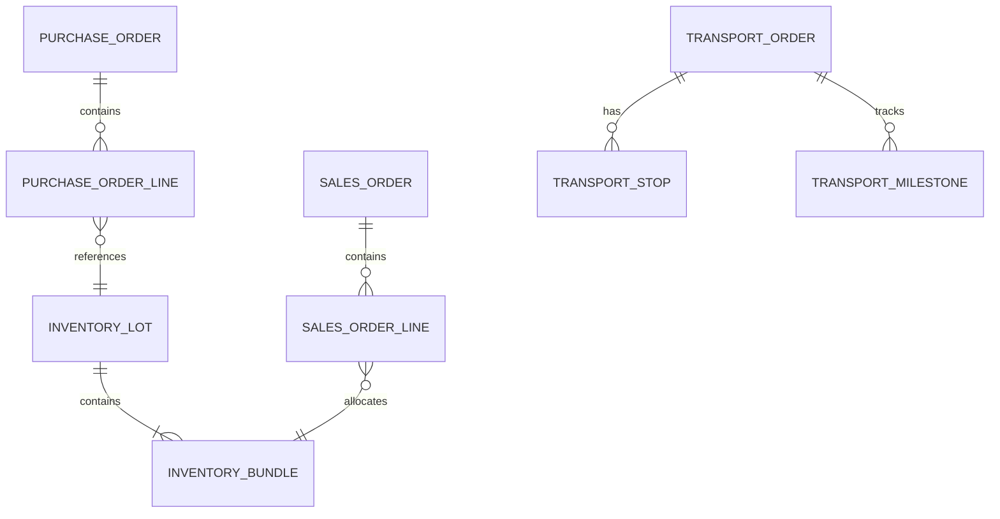

# Custom Supply & Logistics App (CSLA) – Implementation Blueprint

> **Objective**  Replace the current E2open stack with a lightweight, Titan‑centric application suite that manages refined‑metal supply, logistics & inventory end‑to‑end while integrating natively with Transporeon (90 % of moves) and 20 third‑party DCs.

---

## 0  Executive Snapshot

* **Products**  75 refined metals ‑ tracked as 25 t manufacturer lots → 1 t bundles (no partial splitting).
* **Throughput**  ≈ 300 inbound lot releases & ≈ 600 customer deliveries / month (≈ 6 000 trucks).
* **Landscape (to‑be)**

  ```txt
  React Front‑End → CSLA Micro‑services → Titan (real‑time gRPC + Kafka)
                                 ↓
                           Transporeon (API / WS)
                                 ↓
                           20× 3PL WMS (REST)
  ```
* **Hosting**  Supabase Postgres + Edge Functions (public or private cloud) with optional NestJS heavy services on AKS.
* **Cut‑over target**  Q2‑2026.

---

## Main Business Requirements

* **Procurement** – Manage purchase of refined‑metal lots (25 t) & bundles (1 t) with supplier confirmation, Incoterms, tolerance handling.
* **Customer Demand** – Support sales orders with bundle‑to‑lot allocation ensuring full traceability & no partial bundles.
* **Logistics Visibility** – Provide real‑time inbound/outbound tracking: ASN ingestion, carrier milestones, weigh‑bridge variance control.
* **Transport Management** – Create & monitor Transport Orders, integrated with Transporeon (≈ 90 %) and direct EDI carriers (≈ 10 %).
* **Granular Inventory** – Maintain lot & bundle status, weight, purity, certificates across 20 3PL‑managed DCs.
* **Titan Integration** – Consume quotas & write back call‑offs, inventory actuals, valuations in real‑time (gRPC/Kafka) – no nightly reconciles.
* **Compliance & Auditability** – GDPR, chain‑of‑custody, financial audit trails with immutable event log.
* **Performance** – UI p95 < 2 s; DB baseline ≤ 200 tx/s with auto‑scaling.
* **Hosting & Security** – Deployable to private or public cloud; RLS, mTLS, Azure AD SSO.
* **Migration Path** – Dual‑write, cut‑over, and rollback strategy for E2open sunset.

---

## 1  Capabilities & “Done‑When” Criteria

| #  | Capability               | Metal‑Specific Nuance                                                        | Done When…                                      |
| -- | ------------------------ | ---------------------------------------------------------------------------- | ----------------------------------------------- |
| 1  | **Bulk Purchase**        | PO lines in **bundles (1 t)**; each PO references supplier **lot ID (25 t)** | Supplier confirms lot & bundle count            |
| 2  | **Customer Sales**       | Sales lines in bundles; system auto‑maps to lots (traceability)              | Every bundle reserved to an exact lot           |
| 3  | **Logistics Planning**   | Plans built in 25 t/50 t truck or container loads                            | Transport Order (TO) created & carrier assigned |
| 4  | **Inbound Visibility**   | ASN carries **lot ID, bundle serials, net wt.**                              | GRN posted, inventory state = “On‑hand”         |
| 5  | **Outbound Visibility**  | Whole bundles only – no partial picks                                        | POD received per bundle                         |
| 6  | **Transport Order Gen.** | TO payload enumerates bundle IDs + gross wt.                                 | Carrier accepts load                            |
| 7  | **Transport Execution**  | Weigh‑bridge variance < ±0.5 %                                               | All milestones completed                        |
| 8  | **Granular Inventory**   | Hierarchy = Lot (25 t) → 25 × Bundle (1 t)                                   | Single source of truth reconciled               |
| 9  | **Transporeon Int.**     | Slot booking & webhook milestones                                            | Events matched to expected gross wt.            |
| 10 | **Supplier / 3PL Int.**  | EDI 850/856 or REST; chemistry certificates                                  | Data & docs linked to lot record                |

Bounded contexts: **Purchase • Sales • Inventory • Transport • Integration**.

---

## 2  Target Technical Blueprint

### 2.1 Platform Stack

| Layer            | Selection                                                   | Rationale                                   |
| ---------------- | ----------------------------------------------------------- | ------------------------------------------- |
| Database + API   | **Supabase Postgres** (Row‑Level Security)                  | Low‑ops, real‑time subscriptions            |
| Serverless Logic | Supabase Edge Functions (Deno/TS)                           | Close to data; <1 s latency                 |
| Heavy Services   | Docker‑ised **NestJS (TS)** (only where Edge ≪)             | Transport optimisation, high‑fan‑out events |
| Event Mesh       | Supabase Realtime → **Kafka / Redpanda** when scale demands | Matches Titan stream                        |
| Front‑End        | **React 18 + Vite (TS)**                                    | In‑house mandate                            |
| Hosting          | Supabase Cloud **or** self‑host on AKS/OpenShift            | Public or private cloud option              |

### 2.2 Context → Schema Map

| Context     | Supabase Schema              | Notes                                 |
| ----------- | ---------------------------- | ------------------------------------- |
| Purchase    | **purchase**                 | PO↔Lot validation Edge Fn             |
| Inventory   | **inventory**                | Lot & Bundle tables, RLS per 3PL/DC   |
| Sales       | **sales**                    | ATP & bundle allocation Fn            |
| Transport   | **transport** (+ NestJS svc) | Transporeon webhook ingestion         |
| Integration | **integration**              | Supplier EDI parse, Titan gRPC client |

### 2.3 Domain Model (ER excerpt)



---

## 3  Key API Contracts (OpenAPI excerpts)

```yaml
POST /purchase-orders
  body:
    supplier_id: string
    incoterm: string
    lines:
      - lot_id: string   # 25 t lot
        bundle_qty: 25   # integer bundles (1 t each)
        purity_pct: 99.97
        due_date: date

POST /sales-orders
  body:
    customer_id: string
    lines:
      - bundle_qty: 10
        requested_date: date

POST /transport-orders
  body:
    shipment_plan_id: uuid
    carrier_id: string
    equipment: "Truck‑25t"
    stops: [...]
```

Event topics (`JSON/Avro`):

* `lot.created`, `bundle.located`, `so.released`, `to.milestone.*`

---

## 4  Process Flows

### 4.1 Procure‑to‑Receive

1. **Create PO** (`purchase_order`)
2. Supplier sends **EDI 856** → Edge Fn → stub `inventory_lot` + `inventory_bundle` rows
3. Truck arrives; 3PL scans bundles → REST call updates `bundle.status='On‑hand'`

### 4.2 Order‑to‑Deliver

1. React UI posts SO → Fn `allocate_bundles(so_id)` (RLS enforces DC)
2. Bundles reserved → Planner creates TO → Fn books Transporeon slot
3. Webhook milestones stream to UI; POD event closes SO, sets bundles `Delivered`

---

## 5  Integration Blueprint (Titan‑centric)

| Object               | Direction                | Mechanism               | Frequency |
| -------------------- | ------------------------ | ----------------------- | --------- |
| Quota header/line    | **Titan → Kafka → CSLA** | CDC stream              | Real‑time |
| Call‑off             | CSLA → Titan             | gRPC `CreateCalloff`    | Sync      |
| Lot actuals          | CSLA → Titan             | Kafka `inv.lot.updated` | Event     |
| Transport milestones | Transporeon → CSLA       | WebSocket               | Async     |
| 3PL WMS events       | 3PL → CSLA               | REST POST               | Per scan  |

*No Salesforce integrations – forecasts originate in Titan spreadsheets or CSLA CSV upload.*

---

## 6  Non‑Functional Targets

| Aspect       | Baseline                         | Headroom                       |
| ------------ | -------------------------------- | ------------------------------ |
| DB TPS       | < 200 tx/s                       | Supabase auto‑scales to 1 000+ |
| UI latency   | p95 < 250 ms                     | Edge Fn < 1 s budget           |
| Availability | 99.5 % (Supabase Cloud)          | 99.9 %+ self‑host HA           |
| Security     | Supabase Auth + RLS; mTLS to 3PL | Add Keycloak SSO if required   |

---

## 7  Migration & Co‑existence Plan

| Phase    | Task                                                                               |
| -------- | ---------------------------------------------------------------------------------- |
| T‑1 Mo   | Freeze new Call‑offs in E2open; dual‑write to CSLA for regression                  |
| Cut‑over | Export open Trades/Call‑offs/TO/Lots → Azure Blob → Migr‑script loads Titan & CSLA |
| T+1 Wk   | Transporeon creds switched to CSLA; decommission E2open listeners                  |

---

## 8  Open Decisions (highlight for steering‑committee)

| ID | Topic                | Option A (default)            | Option B                  |
| -- | -------------------- | ----------------------------- | ------------------------- |
| A  | **Purity & SKU**     | Separate SKU per purity grade | Attribute‑only            |
| B  | **Cert storage**     | Supabase Storage blob         | External object store     |
| C  | **Weight tolerance** | Block shipment > ±0.5 %       | Configurable per customer |
| D  | **Billing unit**     | Full‑tonne rounded            | Actual weigh‑bridge kg    |

---

## 9  Next Steps

1. Ratify open decisions A–D.
2. Generate Supabase migration scripts for schemas above.
3. Scaffold React screens: *Target Loader*, *Call‑off Workbench*, *Transport Board*.
4. Build Edge Functions stubs + gRPC client for Titan.
5. Schedule dual‑write rehearsal in pre‑prod.

---

*Prepared July 12 2025 by Accenture Supply‑Chain Technology*

---

## 10  Task Management Process

### 10.1 Task Completion Workflow
When a task is completed, Claude must:
1. **Update task status** in the individual task file: `**Status**: 🔴 Pending Approval` → `**Status**: ✅ COMPLETED`
2. **Move task file** from `Docs/tasks/` to `Docs/tasks/completed tasks/`
3. **Update todo list** to mark task as completed
4. **Deploy changes** to development branch

### 10.2 Task File Structure
```markdown
# Task XXX: Category - Task Name
**Status**: ✅ COMPLETED  
**Priority**: High/Medium/Low  
**Estimated Effort**: X hours  
**Prerequisites**: Previous task dependencies
```

### 10.3 Active Task Tracking
- Todo list maintained via TodoWrite tool
- Git commits follow conventional format with Claude Code attribution
- Working tree should be clean before starting new tasks

---

*Updated July 13 2025 with Task Management Process*
EOF < /dev/null