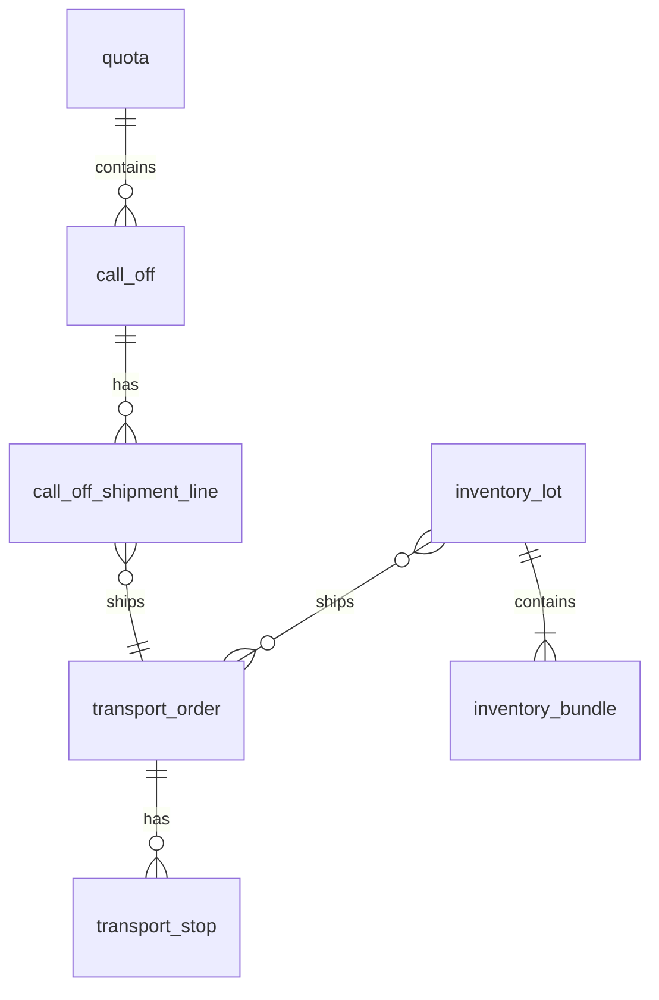

# Core Domain Entities — CSLA v1

*Prepared July 12 2025*

---

## 1  Entity‑Relationship Overview

---

## 2  Entity Definitions

### 2.1  `quota`

| Column           | Type               | PK | Description                |
| ---------------- | ------------------ | -- | -------------------------- |
| quota\_id        | UUID               | ✔  | Titan‑provided primary key |
| counterparty\_id | UUID               |    | Trading partner            |
| direction        | ENUM('BUY','SELL') |    | Trade direction            |
| period\_month    | DATE (YYYY‑MM‑01)  |    | Monthly bucket             |
| qty\_t           | NUMERIC(12,3)      |    | Contract quantity (t)      |
| tolerance\_pct   | NUMERIC(4,2)       |    | ± tolerance                |
| incoterm\_code   | CHAR(3)            |    | FOB, CIF, etc.             |
| metal\_code      | VARCHAR(12)        |    | CU, AL, NI…                |
| created\_at      | TIMESTAMPTZ        |    | Audit                      |

### 2.2  `call_off`

| Column                    | Type                                            | PK | Notes                    |
| ------------------------- | ----------------------------------------------- | -- | ------------------------ |
| call\_off\_id             | UUID                                            | ✔  | Surrogate PK             |
| quota\_id                 | UUID FK→quota                                   |    | Parent quota             |
| call\_off\_number         | TEXT UNIQUE                                     |    | Generated (CO‑YYYY‑NNNN) |
| status                    | ENUM('NEW','CONFIRMED','FULFILLED','CANCELLED') |    | State machine            |
| bundle\_qty               | INT                                             |    | Whole tonnes             |
| requested\_delivery\_date | DATE                                            |    | Customer requested       |
| created\_at               | TIMESTAMPTZ                                     |    | Audit                    |

### 2.3  `call_off_shipment_line`

| Column                 | Type                          | PK | Notes               |
| ---------------------- | ----------------------------- | -- | ------------------- |
| shipment\_line\_id     | UUID                          | ✔  |                     |
| call\_off\_id          | UUID FK                       |    |                     |
| bundle\_qty            | INT                           |    |                     |
| metal\_code            | VARCHAR(12)                   |    | Defaults from quota |
| destination\_party\_id | UUID                          |    | Customer/DC         |
| expected\_ship\_date   | DATE                          |    |                     |
| transport\_order\_id   | UUID FK→transport\_order NULL |    | Assigned by planner |

### 2.4  `transport_order`

| Column               | Type                                                       | PK | Notes            |
| -------------------- | ---------------------------------------------------------- | -- | ---------------- |
| transport\_order\_id | UUID                                                       | ✔  |                  |
| status               | ENUM('NEW','BOOKED','IN\_TRANSIT','DELIVERED','CANCELLED') |    |                  |
| carrier\_id          | UUID                                                       |    |                  |
| gross\_weight\_t     | NUMERIC(12,3)                                              |    | Σ bundle weights |
| created\_at          | TIMESTAMPTZ                                                |    |                  |

### 2.5  `inventory_lot`

| Column            | Type         | PK | Notes                   |
| ----------------- | ------------ | -- | ----------------------- |
| lot\_id           | UUID         | ✔  | Manufacturer lot (25 t) |
| supplier\_id      | UUID         |    |                         |
| metal\_code       | VARCHAR(12)  |    |                         |
| purity\_pct       | NUMERIC(5,3) |    |                         |
| manufacture\_date | DATE         |    |                         |

### 2.6  `inventory_bundle`

| Column     | Type                                              | PK | Notes      |
| ---------- | ------------------------------------------------- | -- | ---------- |
| bundle\_id | UUID                                              | ✔  | 1 t bundle |
| lot\_id    | UUID FK→inventory\_lot                            |    |            |
| weight\_kg | NUMERIC(9,3) default 1000                         |    |            |
| wh\_id     | UUID                                              |    | Warehouse  |
| bin        | TEXT                                              |    | Location   |
| status     | ENUM('ON\_HAND','RESERVED','SHIPPED','DELIVERED') |    |            |

---

## 3  Relationships & Cardinality

* **quota : call\_off** = 1 : N — A quota can spawn many call‑offs.
* **call\_off : call\_off\_shipment\_line** = 1 : N — Each call‑off may have multiple shipment splits.
* **call\_off\_shipment\_line : transport\_order** = M : 1 — Multiple lines can be consolidated into a single TO leg.
* **inventory\_lot : inventory\_bundle** = 1 : 25 — Fixed cardinality for refined‑metal rule.
* **inventory\_lot : transport\_order** = 0 .. N — A lot may be assigned to one or many Transport Orders, or none at all.

---

## 4  Index & Constraint Checklist

| Table                     | Index                                             | Purpose                       |
| ------------------------- | ------------------------------------------------- | ----------------------------- |
| call\_off                 | idx\_calloff\_quota\_status (`quota_id`,`status`) | Fast listing by quota & state |
| call\_off\_shipment\_line | idx\_line\_to (`transport_order_id`)              | Resolve TO aggregates         |
| inventory\_bundle         | idx\_bundle\_wh\_status (`wh_id`,`status`)        | ATP look‑ups                  |

---

## 5  Extensibility Notes

* **Transport Stops** will be normalised in a later sprint; for now, one TO per destination is assumed.
* **Lot Blending** not permitted; if business rules change, introduce `lot_mixture` table.
* **Partial Bundles** (cuts) will be modelled as child rows referencing parent bundle.

---

> Review these definitions and advise of any missing attributes or compliance constraints (e.g., LME pricing linkage, assay custody).
