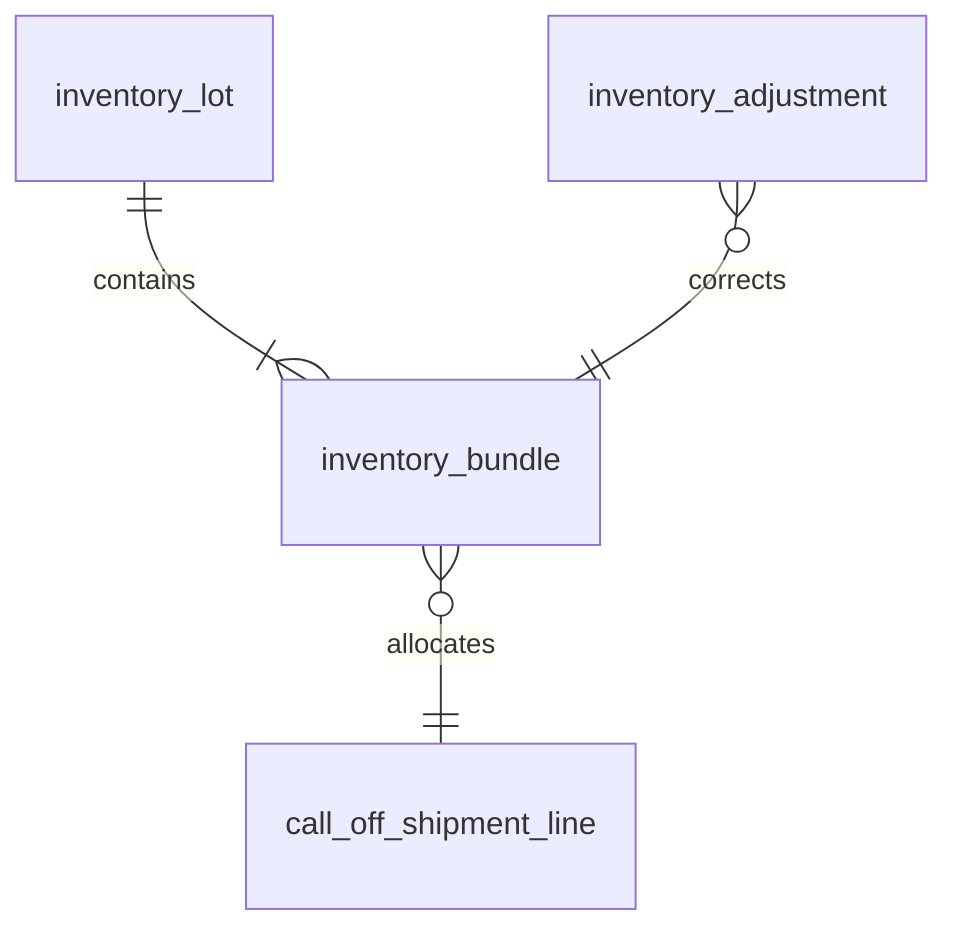
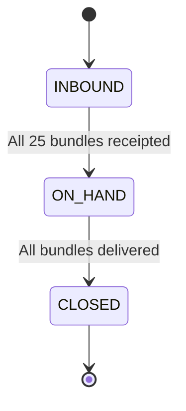
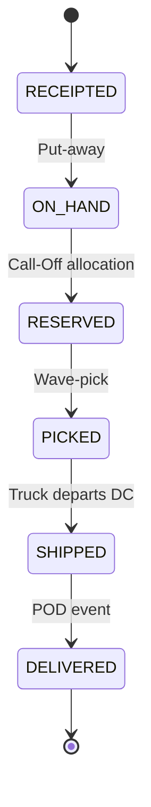

# Build Drop 3 — Inventory & Lot Domain

*Prepared July 12 2025*

> **Goal**  Implement the authoritative inventory ledger for refined metals: Lot (25 t) and Bundle (1 t) creation, status transitions, weight & purity management, WMS event ingestion, and traceability reporting. This drop enables real‑time visibility and sets the stage for ATP/reservation features in later sprints.

---

## 1  Scope of this Drop

| In                                              | Out                      |
| ----------------------------------------------- | ------------------------ |
| ASN import → create lot + bundle stubs          | Sales allocation / ATP   |
| GRN "On‑hand" transition via 3PL WMS webhook    | Demand forecasting       |
| Status changes: RECEIPTED → ON\_HAND → RESERVED | Billing & P\&L valuation |
| Weight variance handling (+/‑0.5 %)             | Power BI inventory cube  |
| Purity certificates upload & linkage            | Cycle‑count workflow     |
| RLS per BU & 3PL                                | Parcel (CEP) integration |

---

## 2  Domain Data Model



### 2.1  `inventory_lot`

| Field             | Type                                | Notes                    |
| ----------------- | ----------------------------------- | ------------------------ |
| `lot_id`          | UUID PK                             | 25 t manufacturer lot ID |
| `supplier_id`     | UUID                                | Counterparty             |
| `metal_code`      | VARCHAR(12)                         | e.g. CU                  |
| `purity_pct`      | NUMERIC(5,2)                        | 99.97                    |
| `manufactured_on` | DATE                                | As per cert              |
| `certificate_url` | TEXT                                | Supabase Storage path    |
| `status`          | ENUM('INBOUND','ON\_HAND','CLOSED') | Lot‑level state          |
| `created_at`      | TIMESTAMPTZ                         | default                  |

### 2.2  `inventory_bundle`

| Field          | Type                                                                   | Notes                                          |
| -------------- | ---------------------------------------------------------------------- | ---------------------------------------------- |
| `bundle_id`    | UUID PK                                                                | Serial barcode                                 |
| `lot_id`       | UUID FK → lot                                                          |                                                |
| `weight_kg`    | NUMERIC(9,3)                                                           | Default 1000 kg; variances captured separately |
| `warehouse_id` | UUID                                                                   | 3PL DC                                         |
| `bin_location` | TEXT                                                                   | Zone/bin                                       |
| `status`       | ENUM('RECEIPTED','ON\_HAND','RESERVED','PICKED','SHIPPED','DELIVERED') |                                                |
| `updated_at`   | TIMESTAMPTZ                                                            | trigger on change                              |

### 2.3  `inventory_adjustment`

| Field             | Type        | Description                         |
| ----------------- | ----------- | ----------------------------------- |
| `adjustment_id`   | UUID PK     |                                     |
| `bundle_id`       | UUID FK     |                                     |
| `delta_weight_kg` | NUMERIC     | +/‑ variance                        |
| `reason_code`     | TEXT        | WEIGH\_VARIANCE / DAMAGE / RE\_TEST |
| `created_by`      | UUID        |                                     |
| `created_at`      | TIMESTAMPTZ |                                     |

---

## 3  Workflow State Machines

### 3.1  Lot Status (`inventory_lot.status`)



### 3.2  Bundle Status (`inventory_bundle.status`)



---

## 4  API Contract (Edge Functions – excerpt)

```yaml
POST /lots/asn
  summary: Create lot + bundles from supplier ASN
  body: {supplier_id, metal_code, lot_id, purity_pct, bundle_barcodes[]}

POST /bundles/{id}/adjust-weight
  summary: Capture weigh‑bridge variance
  body: {delta_weight_kg, reason_code}

GET /bundles?status=ON_HAND&warehouse_id=...
  summary: List available bundles for allocation
```

---

## 5  Build Tasks (@ vibe board)

| #                     | Task                                                | Owner  | Est (d) |
| --------------------- | --------------------------------------------------- | ------ | ------- |
| 1                     | DB migration – lot, bundle, adjustment tables       | DBA    | 0.5     |
| 2                     | Edge Fn `asn_ingest.ts` (create lot+bundles)        | BE     | 1       |
| 3                     | Edge Fn `bundle_adjust.ts` (PATCH weight)           | BE     | 0.5     |
| 4                     | Edge Fn `bundle_status.ts` (PUT status transitions) | BE     | 0.5     |
| 5                     | React screen “Lot & Bundle Explorer”                | FE     | 1       |
| 6                     | React dialog “Weight Adjustment”                    | FE     | 0.5     |
| 7                     | Cypress flows – ASN → Deliver bundle                | QA     | 1.5     |
| 8                     | Postman collection for inventory API                | DevOps | 0.5     |
| *Total ≈ 6 dev days.* |                                                     |        |         |

---

## 6  Acceptance Criteria

* ASN for 25‑bundle lot creates one lot + 25 bundles in DB.
* Bundle status transitions follow exact state machine (error on illegal jump).
* Weight adjustment raises event `inv.bundle.adjusted` into BUS.
* RLS: 3PL user can only see bundles at their warehouse.

---

### Notes / Open Questions

1. **Tolerance handling** — auto‑close adjustment within ±0.5 % vs manual approval?
2. **Purity degradation** — is re‑test event required before shipment if >90 days?
3. **Multi‑org stock** — plan to support consignment lots?

> Provide feedback and we’ll refine schema & functions accordingly.
