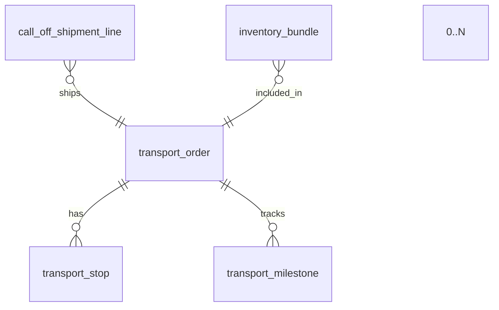
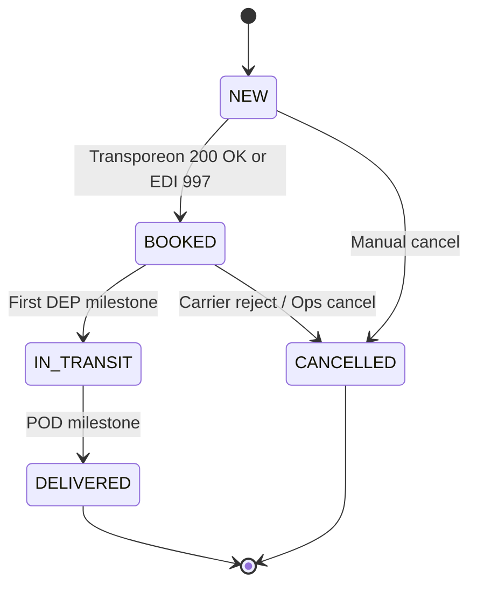

# Build Drop 2 — Transport Order Domain

*Prepared July 12 2025*

> **Goal**  Deliver end‑to‑end Transport Order (TO) capability: plan, book, track, and close shipments for Call‑Off Shipment Lines. 90 % of TOs integrate with Transporeon; 10 % flow through direct EDI. This drop introduces full CRUD, workflow, milestone ingestion, and operational dashboards.

---

## 1  Scope of this Drop

| In                                                   | Out (next drops)         |
| ---------------------------------------------------- | ------------------------ |
| TO data model & RLS                                  | Automated rate shopping  |
| CRUD + state machine for `transport_order`           | Multi‑leg optimisation   |
| `transport_stop` & `transport_milestone` sub‑tables  | Parcel API integration   |
| Link Shipment → TO (FK) & inventory association      | Supply‑chain carbon calc |
| Transporeon REST v2 booking + WebSocket event ingest | Invoice audit            |
| Direct‑EDI adapter (204/214) for minority carriers   | BI cost analytics        |
| React screens: TO Workbench / Milestone tracker      | Mobile driver app        |

---

## 2  Domain Data Model



### 2.1  `transport_order`

| Field                | Type                                                       | Notes                             |
| -------------------- | ---------------------------------------------------------- | --------------------------------- |
| `transport_order_id` | UUID PK                                                    | `gen_random_uuid()`               |
| `carrier_id`         | UUID                                                       | FK → `partner` (carrier)          |
| `booking_reference`  | TEXT UNIQUE NULL                                           | From Transporeon or EDI 990       |
| `mode`               | ENUM('ROAD','SEA','RAIL','AIR')                            | Initial scope ROAD/SEA            |
| `equipment_type`     | VARCHAR(20)                                                | e.g. "40’ HC", "13.6 m tautliner" |
| `gross_weight_t`     | NUMERIC(12,3)                                              | Calc from bundles                 |
| `status`             | ENUM('NEW','BOOKED','IN\_TRANSIT','DELIVERED','CANCELLED') | Workflow below                    |
| `created_by`         | UUID                                                       | Supabase auth.uid()               |
| `created_at`         | TIMESTAMPTZ                                                | default                           |

**RLS**: users need role `OPS` & same BU; carriers get restricted view via service role.

### 2.2  `transport_stop`

| Field                | Type        | Description                |
| -------------------- | ----------- | -------------------------- |
| `stop_id`            | UUID PK     |                            |
| `transport_order_id` | UUID FK     |                            |
| `sequence_no`        | SMALLINT    | 1 = pickup, 2 = drop, etc. |
| `party_id`           | UUID        | FK → customer/DC           |
| `location_code`      | VARCHAR(12) | UNLOCODE or geo hash       |
| `planned_dt`         | TIMESTAMPTZ |                            |
| `actual_dt`          | TIMESTAMPTZ | Filled by milestone        |

### 2.3  `transport_milestone`

| Field                | Type                          | Notes                                            |
| -------------------- | ----------------------------- | ------------------------------------------------ |
| `milestone_id`       | UUID PK                       |                                                  |
| `transport_order_id` | UUID FK                       |                                                  |
| `event_code`         | ENUM('DEP','ARR','POD','EXC') | Departure, Arrival, Proof of Delivery, Exception |
| `event_dt`           | TIMESTAMPTZ                   |                                                  |
| `payload_json`       | JSONB                         | Raw Transporeon or EDI 214 segment               |

---

## 3  Workflow State Machine – `transport_order.status`



Guard rails: cannot BOOK if no stops; cannot CANCEL after DELIVERED.

---

## 4  API Contract (Edge Functions, OpenAPI 3.1 excerpt)

```yaml
POST /transport-orders
  body:
    mode: ROAD
    carrier_id: uuid
    stops: [{sequence_no:1, party_id: uuid, location_code:"FRLEH", planned_dt:"2025-08-01T08:00Z"}, ...]
    shipment_line_ids: [uuid, uuid]

POST /transport-orders/{id}/book
  summary: Performs Transporeon booking, sets status NEW→BOOKED

PATCH /transport-orders/{id}
  summary: Update mutable fields when status = NEW
```

Webhook endpoint `/hooks/transporeon` ingests WS events → inserts milestones and status updates.

---

## 5  Build Tasks (@ vibe‑coding board)

| #                     | Task                                                 | Owner  | Est (d) |
| --------------------- | ---------------------------------------------------- | ------ | ------- |
| 1                     | DB migration – transport\_order, stop, milestone     | DBA    | 1       |
| 2                     | Edge Fn `create_transport_order.ts` + RLS            | BE Dev | 1       |
| 3                     | Edge Fn `book_transporeon.ts` (REST v2)              | BE Dev | 1.5     |
| 4                     | WS listener `transporeon_ws.ts` → milestone insert   | BE Dev | 1.5     |
| 5                     | React “TO Workbench” list + detail                   | FE Dev | 1.5     |
| 6                     | React milestone timeline component                   | FE Dev | 1       |
| 7                     | Cypress E2E – create→book→deliver path               | QA     | 1       |
| 8                     | DevOps – secrets rotation, Transporeon sandbox creds | DevOps | 0.5     |
| 9                     | Demo & sign‑off                                      | PM     | 0.5     |
| *Total ≈ 9 dev days.* |                                                      |        |         |

---

## 6  Acceptance Criteria

* TO can be created, booked, and linked to ≥1 shipment line.
* Transporeon booking returns reference; status flips to BOOKED.
* WS events DEP/ARR/POD move status and timestamps correctly.
* Cancellation only allowed in NEW/BOOKED.
* All CRUD & events enforce RLS.

---

### Notes / Open Questions

1. **Multiple Equipment** – future requirement for split loads? Out of scope.
2. **Cost capture** – rate card vs auction? Not in Drop 2.
3. **Exception codes** – standard subset of Transporeon’s 50+?
4. **Direct EDI carriers** – confirm VAN connectivity SLA.
