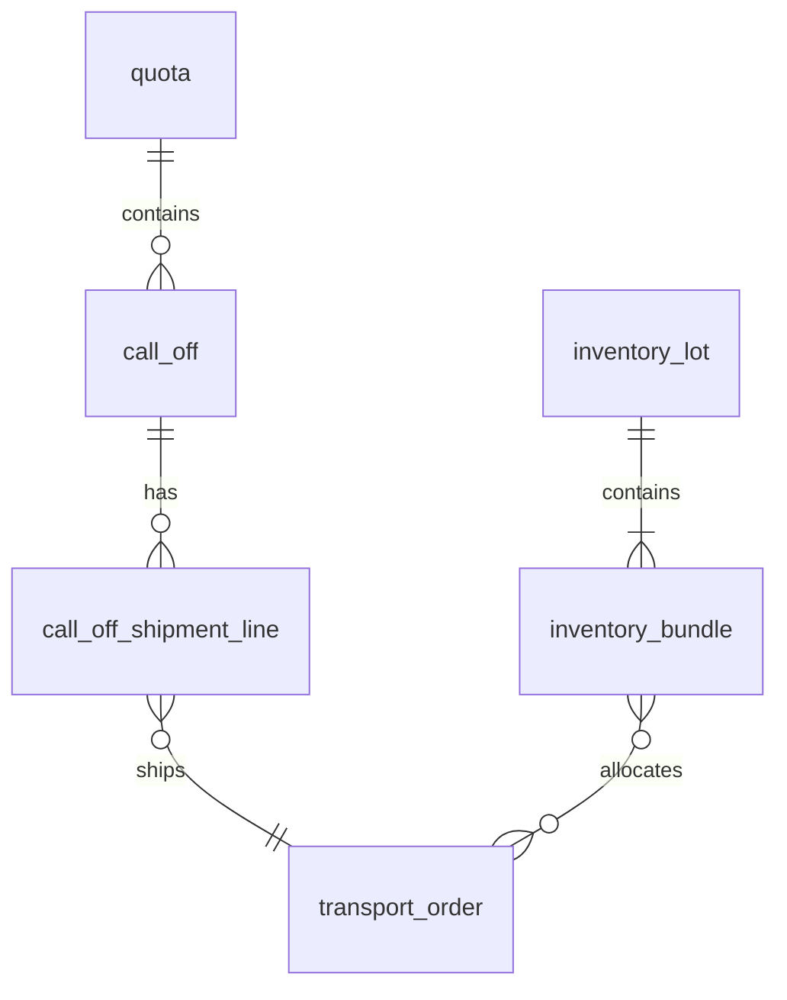

# Database Schema Documentation

This directory contains the complete database schema for the Supply Chain Logistics App (CSLA).

## 📁 Migration Files

### Core Schema (Drop 1)
- **001_create_enums.sql** - All ENUM types for the application
- **002_create_quota_table.sql** - Quota definitions from Titan
- **003_create_call_off_table.sql** - Call-off orders with workflow
- **004_create_call_off_shipment_line_table.sql** - Shipment planning
- **005_create_transport_order_table.sql** - Transport orders (stub)
- **006_create_inventory_lot_table.sql** - 25t manufacturer lots
- **007_create_inventory_bundle_table.sql** - 1t bundle units
- **008_create_call_off_number_generator.sql** - Auto number generation
- **009_create_business_views.sql** - Performance views

## 🏗️ Schema Overview

### Entity Relationships


### Core Tables

#### `quota` - Titan CDC Import
- Primary source of trade quotas
- Monthly periods with metal/direction/counterparty
- Tolerance percentages for over/under consumption

#### `call_off` - Business Orders  
- Orders against quotas with workflow states
- Auto-generated call-off numbers (CO-YYYY-NNNN)
- State machine: NEW → CONFIRMED → FULFILLED/CANCELLED

#### `inventory_lot` & `inventory_bundle`
- 25t lots containing 25 × 1t bundles  
- Full traceability from supplier to delivery
- Certificate storage and quality tracking

#### Business Views
- `v_call_off_summary` - Complete call-off details
- `v_quota_balance` - Remaining quota calculations
- `v_bundle_availability` - ATP inventory lookup

## 🔧 Usage Instructions

### Local Development
```bash
# Install Supabase CLI
npm install -g supabase

# Login and link project
supabase login
supabase link --project-ref brixbdbunhwlhuwunqxw

# Apply migrations
supabase db push
```

### Production Deployment
```bash
# Run migrations in sequence
psql -f migrations/001_create_enums.sql
psql -f migrations/002_create_quota_table.sql
# ... continue through all files
```

## 📊 Key Performance Features

### Indexes
- `idx_call_off_quota_status` - Fast call-off filtering
- `idx_inventory_bundle_wh_status` - ATP lookups
- `idx_quota_counterparty_period` - Quota searches

### Constraints
- Call-off number pattern validation
- Weight tolerance enforcement (±5%)
- Workflow timestamp logic
- Data range validations

### Triggers
- Auto call-off number generation
- Updated_at timestamp maintenance
- Workflow state validation

## 🔒 Security Notes

- RLS policies will be added in migration 010+
- User profiles for multi-tenant access
- Service role for system operations
- Audit trails on all business entities

## 🚀 Next Steps

1. **Task 006**: Implement Row-Level Security policies
2. **Task 007**: Add performance indexes and constraints  
3. **Task 008**: Create seed data for development
4. **Task 009**: Build API layer (Edge Functions)

---

*Schema designed for 300 inbound lots/month, 600 deliveries/month, targeting <2s UI response times*